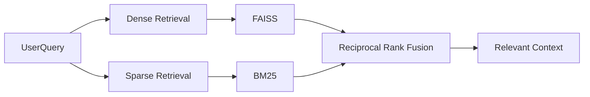
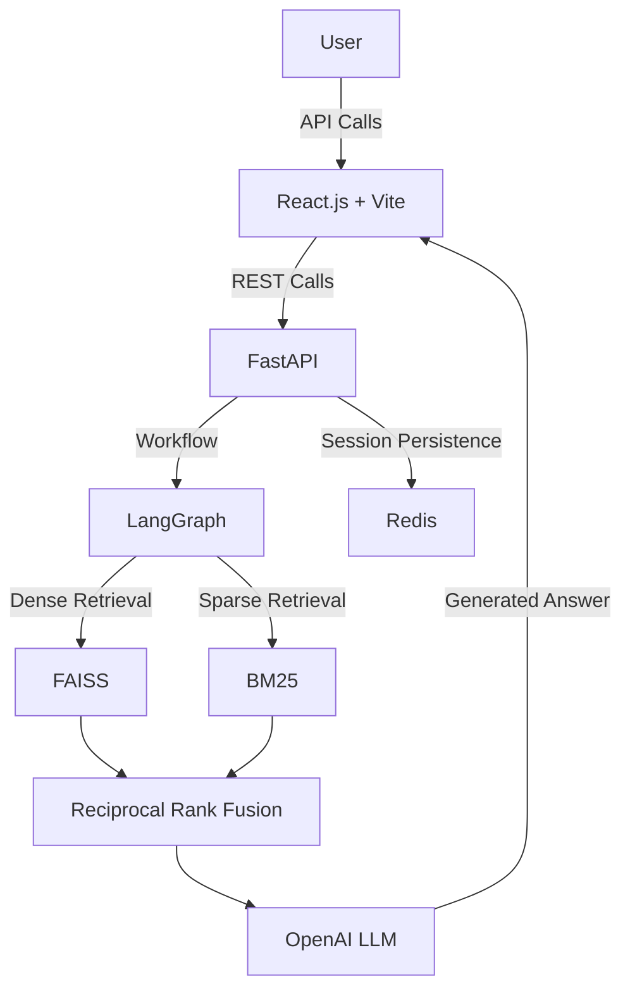
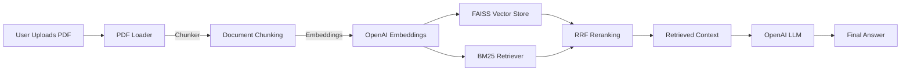
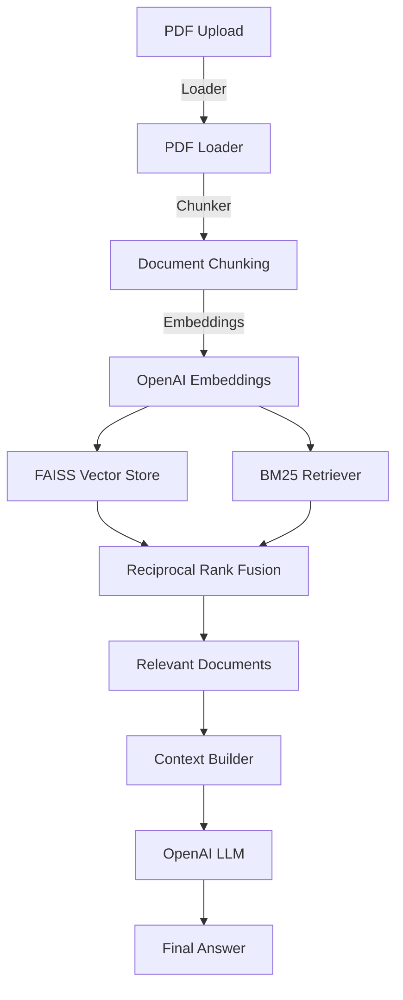
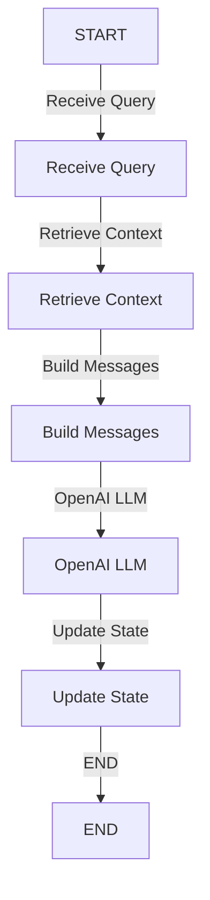
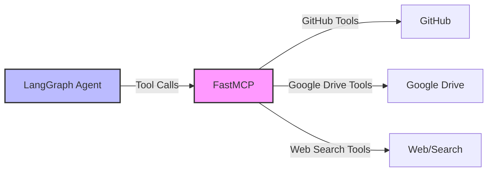

"# Agentic Hybrid RAG Research Assistant

A full-stack Agentic Hybrid RAG Research Assistant for intelligent document analysis and conversational research. The system combines dense and sparse retrieval, Reciprocal Rank Fusion (RRF), LangGraph stateful memory, OpenAI LLMs, FastAPI, Redis, and FastMCP to provide context-aware, extensible AI-powered document interactions.

## 🚀 Overview

The system allows users to upload PDF documents and interact with them through a conversational interface.

Instead of relying on a single retrieval strategy, the system combines:

- **Dense retrieval** using FAISS + OpenAI embeddings
- **Sparse retrieval** using BM25
- **Reciprocal Rank Fusion (RRF)** for combining retrieval results
- **OpenAI LLMs** for grounded response generation
- **LangGraph** for stateful conversational memory
- **FastMCP** for external tool integration
- **Redis** for persistent session management
- **FastAPI** for backend APIs
- **React.js + Vite** for the frontend
- **Docker** for full-stack containerization

The architecture is designed to evolve from a conventional RAG application into an agentic research platform capable of interacting with external tools and knowledge sources.

## ⚙️ Local Development

1. **Clone the repository**

   ```bash
   git clone https://github.com/Prana-labs/Agent.git
   cd X_post_tool
   ```

2. **Backend Setup**

   ```bash
   python -m venv venv
   source venv/bin/activate
   pip install -r Backend/requirements.txt
   ```

3. **Environment Variables**

   Create a `.env` file:

   ```text
   OPENAI_API_KEY=your_openai_api_key
   LANGSMITH=Langsmith-credentials
   ```

   Add any additional credentials required by your MCP integrations.

   Never commit `.env` or API keys to GitHub.

4. **Start Backend**

   ```bash
   cd Backend
   uvicorn main:app --reload --port 8000
   ```

   - Backend: http://localhost:8000
   - Swagger documentation: http://localhost:8000/docs

5. **Start Frontend**

   From the frontend directory:

   ```bash
   cd Frontend
   npm install
   npm run dev
   ```

   - Frontend: http://localhost:5173

## ✨ Key Features

### 🔎 Hybrid Retrieval

Combines multiple retrieval strategies to improve document search:



### 🧠 Stateful Conversational Memory

Uses LangGraph to maintain conversation state across multiple questions.

**Example:**

- User: What is this paper about? 
- AI: The paper discusses...
- User: What methodology does it use? 
- AI: The paper uses...
- User: What are its limitations? 
- AI: The limitations include...

The system maintains the conversation context so follow-up questions can be interpreted correctly.

### 🤖 OpenAI LLM Integration

Uses OpenAI language models for:

- Context-aware answer generation
- Conversational responses
- Document-grounded generation
- Agent/tool workflows

### 🔌 FastMCP Tool Integration

The architecture supports external tools through FastMCP, allowing the AI system to interact with external services.

**Current tool integrations include capabilities for services such as:**

- GitHub
- Google Drive

This provides an extensible foundation for adding additional tools and external knowledge sources.

### ⚡ FastAPI Backend

Provides REST APIs for:

- PDF upload
- Conversational querying
- Session management
- Chat history
- Backend/frontend communication

### 💾 Redis Session Management

Redis is used for scalable session persistence and state management, helping prevent session loss during application restarts and supporting concurrent users.

### 🎨 React + Vite Frontend

A responsive conversational interface built using:

- React.js
- Vite
- API-based communication with FastAPI

### 🐳 Dockerized Full Stack

The application can be containerized as a full-stack deployment containing:

- React + Vite
- FastAPI
- RAG Pipeline
- LangGraph
- FastMCP

## 🏗️ System Architecture



**Detailed Flow:**



## 🔄 RAG Pipeline

The document processing pipeline follows:



## 🧠 Conversational Workflow

LangGraph manages the conversational state.



Each conversation is associated with a session/thread so that previous messages can be used when processing subsequent queries.

## 🔌 MCP Architecture

The system is designed to extend the RAG assistant with external tools through FastMCP.



This allows the system to move beyond document-only question answering toward tool-assisted research workflows.

**Example:**

> User: Compare the methodology in my uploaded paper with its implementation on GitHub.

> LangGraph Agent → FastMCP → GitHub MCP → Repository Data

> OpenAI LLM → Comparison

## 🛠️ Technology Stack

### Frontend

- React.js
- Vite
- JavaScript

### Backend

- Python
- FastAPI
- Pydantic
- Uvicorn

### RAG / NLP

- LangChain
- LangGraph
- OpenAI LLMs
- OpenAI Embeddings
- FAISS
- BM25
- Reciprocal Rank Fusion (RRF)

### Agent / Tools

- FastMCP
- GitHub tools
- Google Drive tools

### Storage

- Redis
- FAISS

### Infrastructure

- Docker
- AWS EC2
- AWS S3
- Git / GitHub

## 📁 Project Structure

```text
project/ │ ├── Backend/ │   │ ├── main.py │   ├── rag.py │   ├── LLMs.py │   ├── state.py │   ├── requirements.txt │   └── ... │ ├── Frontend/ │   │ ├── src/ │   ├── public/ │   ├── package.json │   ├── vite.config.js │   └── ... │ ├── supervisord.conf ├── Dockerfile ├── .dockerignore └── README.md
```

## 🔗 API Endpoints

### Health Check

**GET /** Returns the backend status.

### Upload PDF

**POST /upload** Uploads a PDF and initializes the document retrieval/session pipeline.

**Example response:**

```json
{   "message": "PDF uploaded successfully",   "filename": "research_paper.pdf",   "thread_id": "..." }
```

The returned `thread_id` is used for subsequent conversations.

### Chat

**POST /chat** Sends a question against the uploaded document.

**Example:**

```text
thread_id = <thread_id>
question = "What is the main contribution of this paper?"
```

### Conversation History

**GET /history/{thread_id}** Returns the conversation history associated with a session.

## 🐳 Docker

The project includes a full-stack Docker configuration.

```bash
docker build -t hyde .
docker run \
  --name hyde-container \
  -p 8000:8000 \
  -p 5173:5173 \
  hyde:latest
```

The services are available at:

- Frontend: http://localhost:5173
- Backend: http://localhost:8000
- Swagger: http://localhost:8000/docs

## 🔐 Environment & Secrets

API keys and credentials should be supplied through environment variables.

**Do not store:**

- `.env`
- API keys
- OAuth credentials
- Cloud credentials
- MCP credentials

inside the Git repository or Docker image.

## 📈 Future Improvements

Planned improvements include:

- Agent-based dynamic tool routing
- Additional FastMCP integrations
- Web search capabilities
- RAG evaluation and benchmarking
- Source/page-level citations
- Streaming responses
- Advanced query rewriting
- Multi-document research
- Long-term persistent conversation memory
- Production-grade observability
- Scalable cloud deployment

## 🎯 Project Goals

The project is designed to demonstrate the engineering of a modern GenAI application, combining:

- RAG + Hybrid Retrieval + RRF + LLMs + LangChain + LangGraph + Conversational Memory + FastMCP + FastAPI + Redis + React + Docker

The long-term goal is to evolve the system from a document question-answering application into a tool-using AI research assistant capable of retrieving, reasoning over, and synthesizing information from multiple knowledge sources.

## 👨‍💻 Author

**Priyanshu Rana**

Built as a full-stack Generative AI / RAG engineering project.

---

*This project serves as a comprehensive demonstration of modern Generative AI application engineering, integrating retrieval-augmented generation, agentic workflows, and full-stack development practices.*"